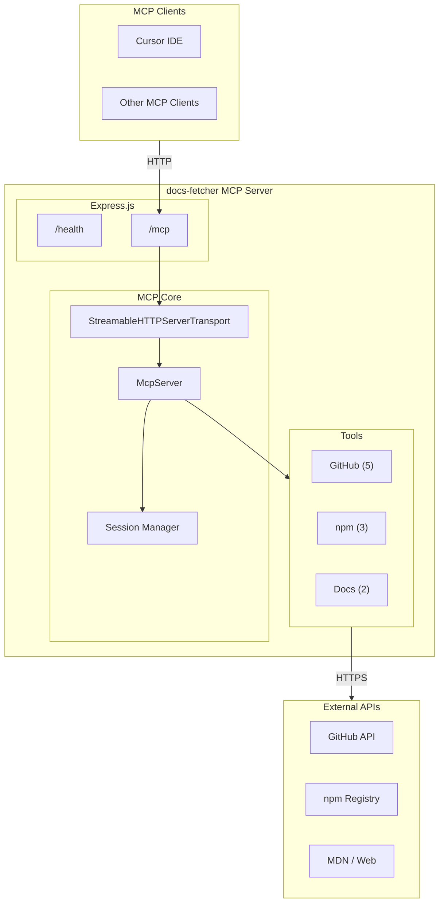
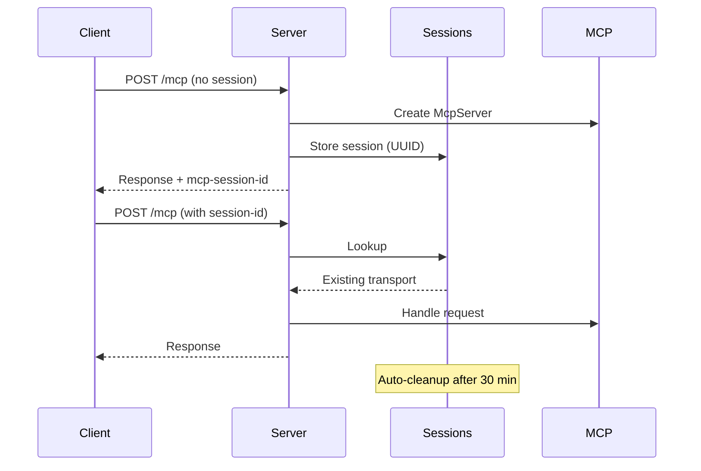
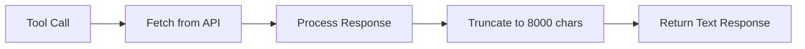
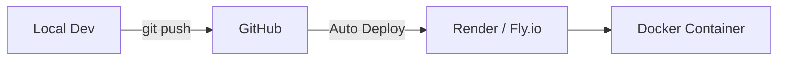

# Architecture

Technical architecture of the **docs-fetcher** MCP server.

## Project Structure

```
docs-fetcher/
├── server.js           # Express server & MCP setup
├── tools/
│   ├── github.js       # GitHub tools (5)
│   ├── npm.js          # npm tools (3)
│   └── docs.js         # Documentation tools (2)
├── utils/
│   └── fetcher.js      # HTTP utilities & formatters
├── package.json
└── Dockerfile
```

## System Overview



## HTTP Layer

| Endpoint | Method | Purpose |
|----------|--------|---------|
| `/mcp` | POST | Tool calls and initialization |
| `/mcp` | GET | SSE stream for sessions |
| `/mcp` | DELETE | Session cleanup |
| `/health` | GET | Health check |

## Session Management

Each client gets a unique session with 30-minute inactivity timeout.



## Tool Implementation

All tools follow the same pattern:



### External APIs Used

| Tool Category | APIs |
|---------------|------|
| GitHub | `api.github.com`, `raw.githubusercontent.com` |
| npm | `registry.npmjs.org`, `api.npmjs.org` |
| Docs | `developer.mozilla.org`, any URL |

### Tool Behaviors

- **GitHub tools**: Try branches `main` → `master` → `canary`
- **npm tools**: Fetch from both registry and downloads API
- **Docs tools**: Use Mozilla Readability for content extraction

## Dependencies

| Package | Purpose |
|---------|---------|
| `@modelcontextprotocol/sdk` | MCP protocol |
| `express` | HTTP server |
| `zod` | Input validation |
| `jsdom` | DOM parsing |
| `@mozilla/readability` | Content extraction |

## Deployment



### Container

- Base: `node:22-alpine`
- Port: `3000` (configurable via `PORT`)
- Health check: `/health`

## Future Considerations

- [x] npm tools
- [x] Web content fetching
- [ ] PyPI tools (Python)
- [ ] Crates.io tools (Rust)
- [ ] Response caching
- [ ] Private repo auth
- [ ] Rate limiting

---

*Last updated: January 2026*
