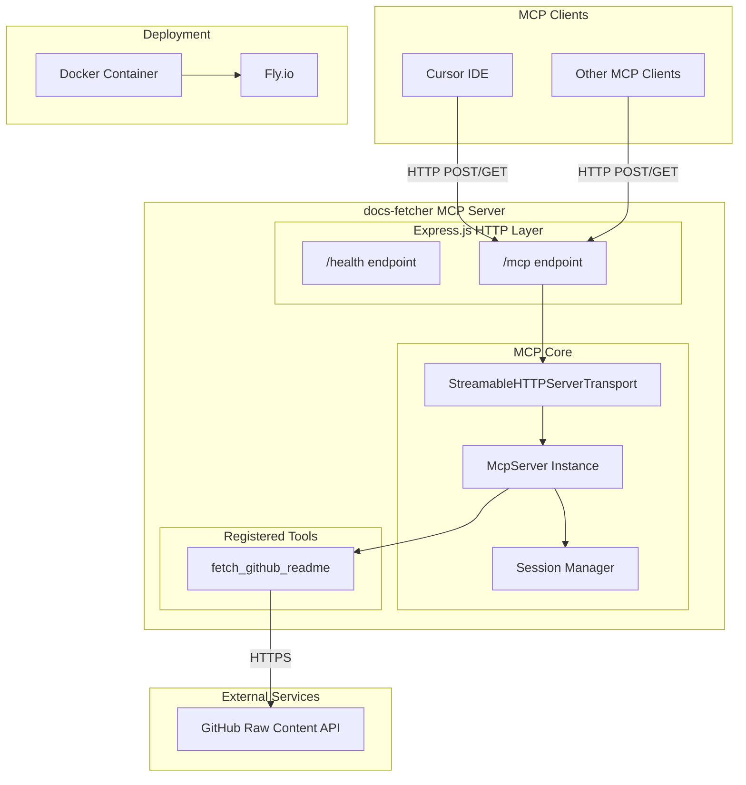
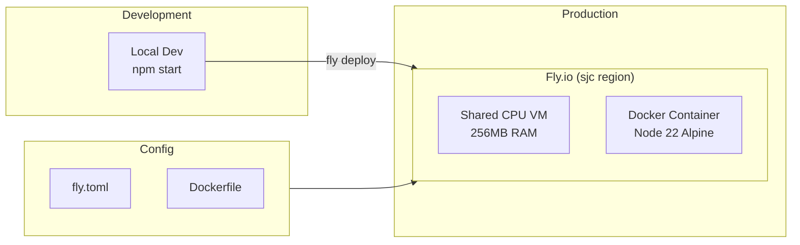

# Architecture

This document describes the architecture of the **docs-fetcher** MCP server.

## Overview

The docs-fetcher is a Model Context Protocol (MCP) server that provides tools for fetching documentation from external sources. It exposes an HTTP-based MCP endpoint that AI assistants (like Cursor) can connect to.

## System Architecture

## Component Details

### HTTP Layer (Express.js)

| Endpoint | Method | Description |
|----------|--------|-------------|
| `/health` | GET | Health check - returns server status |
| `/mcp` | POST | Main MCP endpoint for tool calls and initialization |
| `/mcp` | GET | SSE stream endpoint for existing sessions |
| `/mcp` | DELETE | Session cleanup |

### MCP Server

The core MCP server handles:
- **Protocol negotiation** - Implements MCP specification
- **Tool registration** - Registers available tools with schemas
- **Session management** - Creates and manages client sessions
- **Request routing** - Routes tool calls to appropriate handlers

### Session Management

### Registered Tools

#### `fetch_github_readme`

Fetches README files from public GitHub repositories.

| Parameter | Type | Description |
|-----------|------|-------------|
| `owner` | string | GitHub repository owner/organization |
| `repo` | string | GitHub repository name |

**Behavior:**
1. Tries multiple branch names: `main`, `master`, `canary`
2. Tries multiple filename variations: `README.md`, `readme.md`, `Readme.md`
3. Returns first successful match (truncated to 5000 chars)
4. Returns error if no README found

## Deployment Architecture

### Deployment Configuration

| Setting | Value | Description |
|---------|-------|-------------|
| Region | `sjc` | San Jose, California |
| Memory | 256MB | Shared CPU instance |
| Auto-stop | Enabled | Stops when idle |
| Auto-start | Enabled | Starts on request |
| HTTPS | Forced | All traffic over HTTPS |

## Dependencies

| Package | Purpose |
|---------|---------|
| `@modelcontextprotocol/sdk` | MCP protocol implementation |
| `express` | HTTP server framework |
| `zod` | Schema validation for tool inputs |

## Future Considerations

<!-- Add notes here when planning new features -->

- [ ] Add more documentation fetching tools (npm, PyPI, etc.)
- [ ] Add caching layer for frequently requested READMEs
- [ ] Add authentication for private repositories
- [ ] Add rate limiting

---

*Last updated: January 2026*
